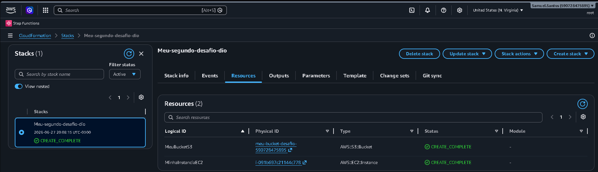
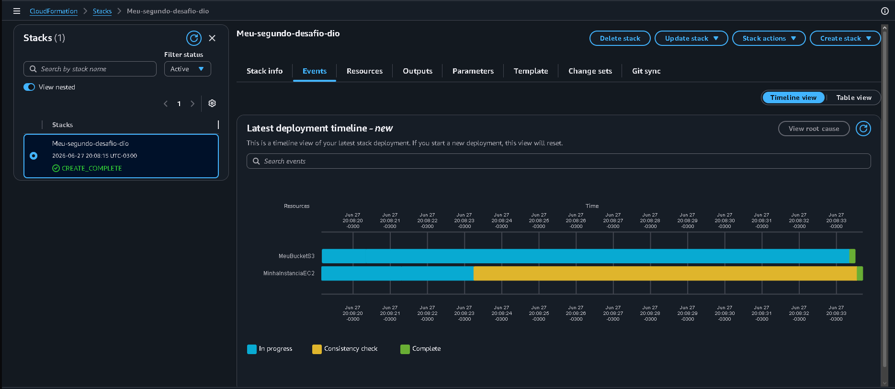
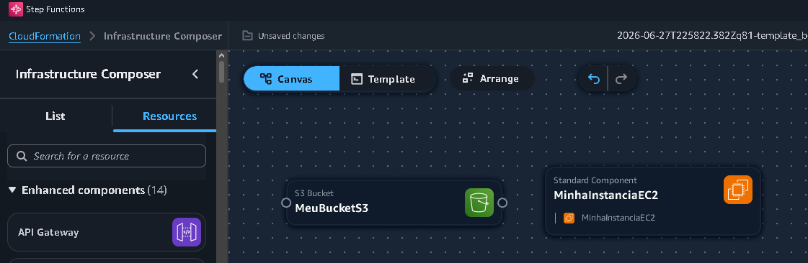

# Desafio de Infraestrutura Automatizada - CloudFormation

## Descrição
Este repositório documenta a implementação de uma infraestrutura automatizada com AWS CloudFormation. O projeto consiste em um Bucket S3 e uma instância EC2 provisionados via código (JSON). O objetivo principal é consolidar conhecimentos em automação, versionamento e IaC (Infraestrutura como Código).

## Insights Adquiridos
- **IaC na Prática:** Compreensão do ciclo de vida de uma Stack (Create, Rollback, Complete).
- **Resolução de Problemas:** Identificação e correção de erro de elegibilidade na camada gratuita (Free Tier), aprendendo a ajustar parâmetros de `InstanceType`.
- **Ferramentas de Suporte:** Utilização do *AWS Infrastructure Composer* para visualização e validação arquitetural da infraestrutura.
  
## Evidências do Desafio

### Recursos Criados

### Timeline de Deploy

### Arquitetura (Infrastructure Composer)

